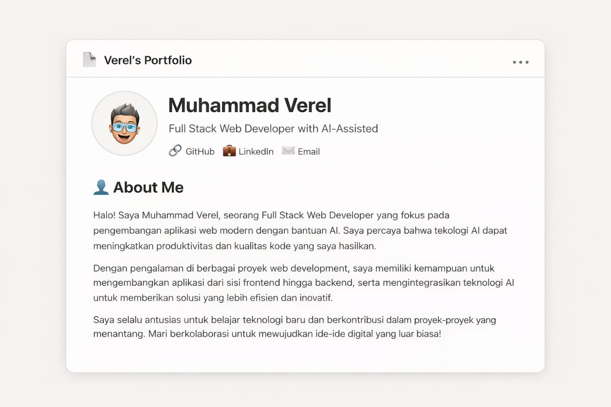

# Muhammad Verel - Portfolio

A modern, Notion-inspired portfolio website built with React, Vite, and Tailwind CSS.



## 🚀 Live Demo

[verel.dev](https://verel.dev) *(coming soon)*

## ✨ Features

- **Notion-inspired Design** - Clean, minimalist UI with document-like aesthetics
- **Fully Responsive** - Optimized for mobile, tablet, and desktop
- **SEO Optimized** - Meta tags, Open Graph, Twitter Cards, and JSON-LD structured data
- **Fast Performance** - Built with Vite for blazing-fast development and production builds
- **PWA Ready** - Web app manifest for installable experience

## 🛠️ Tech Stack

- **React 19** - UI library
- **Vite 7** - Build tool & dev server
- **Tailwind CSS 4** - Utility-first CSS framework
- **ESLint** - Code linting

## 📁 Project Structure

```
portfolio-verel/
├── public/
│   ├── profile.png
│   ├── og-image.png
│   ├── resume.pdf
│   ├── site.webmanifest
│   └── projects/
├── src/
│   ├── components/
│   │   ├── Navbar.jsx
│   │   ├── HeroSection.jsx
│   │   ├── AboutMe.jsx
│   │   ├── TechStack.jsx
│   │   ├── Projects.jsx
│   │   ├── WorkExperience.jsx
│   │   ├── Education.jsx
│   │   ├── Certification.jsx
│   │   ├── Testimonial.jsx
│   │   └── CTAHireMe.jsx
│   ├── App.jsx
│   ├── App.css
│   └── main.jsx
├── index.html
└── package.json
```

## 🚀 Getting Started

### Prerequisites

- Node.js 18+
- npm or yarn

### Installation

```bash
# Clone the repository
git clone https://github.com/mhdverel/portfolio-verel.git

# Navigate to project directory
cd portfolio-verel

# Install dependencies
npm install

# Start development server
npm run dev
```

### Build for Production

```bash
npm run build
```

## 📝 Sections

1. **Hero** - Profile photo, name, title, and social links
2. **About Me** - Personal introduction
3. **Tech Stack** - Technologies and tools
4. **Projects** - Featured projects (DIGIMURA, DOGTOWNLADS)
5. **Work Experience** - Professional experience
6. **Education** - Academic background
7. **Certification** - Professional certifications
8. **Testimonial** - Client feedback
9. **Contact** - CTA with email and LinkedIn

## 📄 License

This project is open source and available under the [MIT License](LICENSE).

## 👤 Author

**Muhammad Verel**

- GitHub: [@mhdverel](https://github.com/mhdverel)
- LinkedIn: [muhammad-verel](https://www.linkedin.com/in/muhammad-verel/)
- Email: mhdverel27@gmail.com

---

Built with **Vibe Code** inspired by **Notion** ✨
